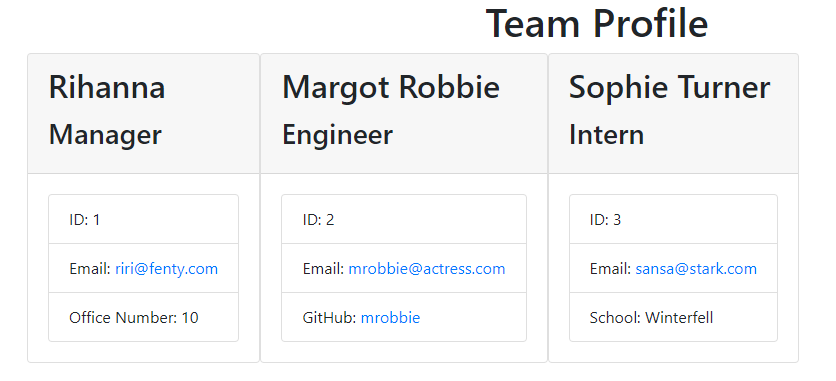

# Team Profile Generator

# Table of Contents
  * [Description](#description)
  * [Installation](#installation)
  * [Usage](#usage)
  * [Contributing](#contributing)
  * [Tests](#tests)
  * [Questions](#Questions)
 
   ## Walkthrough Video
   ### Link
   https://drive.google.com/file/d/19v8vxDAhY3O2nODzVVFJtprjqjMLIrjZ/view
 

  ### View as GIF
  

  ## Screenshot
  

  ## Description
  A Node.js command-line application that will generate an HTML webpage displaying a team's profile of all employees. Unit tests were created for each of the employee's roles.

  ## Installation
  Clone repository from GitHub. Install Node.js. Install Inquirer package.

  ## Usage
  Start the application by typing "node index.js" at the command line. Answer the series of prompts.

  ## Contributing
  Made with ❤️ by Becca Wyland with help from Fahrija Wyroski (fellow coding bootcamp student) and coding bootcamp TAs.

  ## Tests
  Test files for Employee, Manager, Engineer, and Intern roles were written.

  ## Questions
  For any questions regarding this app, please email rwyland@uwalumni.com or visit https://github.com/rwyland189.